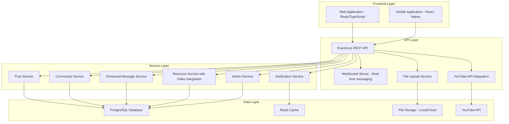
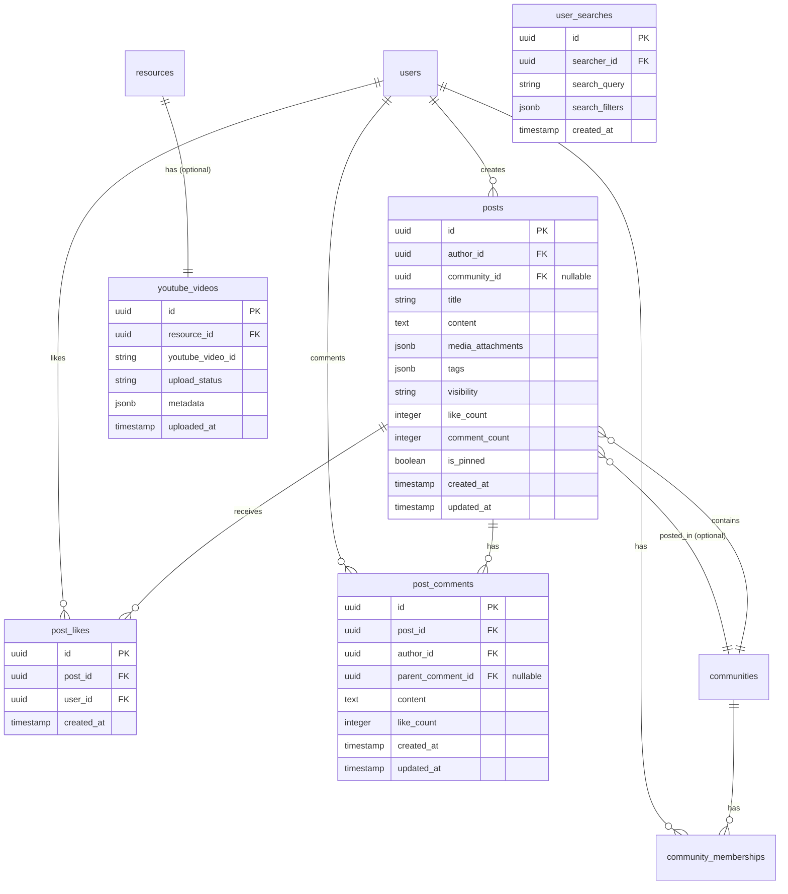

# Design Document

## Overview

This design document outlines the architecture and implementation approach for enhancing the teacher hub platform with comprehensive post management, community creation and management, enhanced messaging capabilities, resource sharing with video integration, and administrative oversight features. The design builds upon the existing architecture while introducing new data models, services, and user interfaces to support these advanced features.

## Architecture

### System Architecture Overview

The enhanced platform follows a layered architecture pattern:



### Database Schema Extensions

The design extends the existing database schema with new tables and relationships:



## Components and Interfaces

### 1. Post Management System

#### Data Models

```typescript
interface Post {
  id: string;
  authorId: string;
  communityId?: string;
  title: string;
  content: string;
  mediaAttachments: MediaAttachment[];
  tags: string[];
  visibility: 'public' | 'community' | 'followers';
  likeCount: number;
  commentCount: number;
  isPinned: boolean;
  createdAt: Date;
  updatedAt: Date;
}

interface PostComment {
  id: string;
  postId: string;
  authorId: string;
  parentCommentId?: string;
  content: string;
  likeCount: number;
  createdAt: Date;
  updatedAt: Date;
}

interface PostLike {
  id: string;
  postId: string;
  userId: string;
  createdAt: Date;
}

interface MediaAttachment {
  id: string;
  type: 'image' | 'video' | 'document';
  url: string;
  thumbnailUrl?: string;
  filename: string;
  size: number;
}
```

#### Service Interface

```typescript
interface PostService {
  createPost(authorId: string, postData: CreatePostRequest): Promise<Post>;
  updatePost(postId: string, authorId: string, updates: UpdatePostRequest): Promise<Post>;
  deletePost(postId: string, authorId: string): Promise<void>;
  getPost(postId: string, viewerId?: string): Promise<Post>;
  getFeedPosts(userId: string, pagination: PaginationOptions): Promise<PaginatedResponse<Post>>;
  getCommunityPosts(communityId: string, pagination: PaginationOptions): Promise<PaginatedResponse<Post>>;
  getUserPosts(userId: string, pagination: PaginationOptions): Promise<PaginatedResponse<Post>>;
  likePost(postId: string, userId: string): Promise<void>;
  unlikePost(postId: string, userId: string): Promise<void>;
  addComment(postId: string, authorId: string, content: string, parentCommentId?: string): Promise<PostComment>;
  getPostComments(postId: string, pagination: PaginationOptions): Promise<PaginatedResponse<PostComment>>;
}
```

### 2. Community Management System

#### Enhanced Data Models

```typescript
interface Community {
  id: string;
  name: string;
  description: string;
  type: 'subject' | 'region' | 'grade' | 'general';
  ownerId: string;
  moderators: string[];
  isPrivate: boolean;
  requiresApproval: boolean;
  rules: CommunityRule[];
  imageUrl?: string;
  memberCount: number;
  postCount: number;
  isActive: boolean;
  createdAt: Date;
  updatedAt: Date;
}

interface CommunityMembership {
  id: string;
  communityId: string;
  userId: string;
  role: 'member' | 'moderator' | 'owner';
  status: 'active' | 'pending' | 'banned';
  joinedAt: Date;
  permissions: CommunityPermission[];
}

interface CommunityRule {
  id: string;
  title: string;
  description: string;
  order: number;
}

interface CommunityPermission {
  action: 'post' | 'comment' | 'moderate' | 'invite' | 'manage_members';
  granted: boolean;
}
```

#### Service Interface

```typescript
interface CommunityService {
  createCommunity(ownerId: string, communityData: CreateCommunityRequest): Promise<Community>;
  updateCommunity(communityId: string, ownerId: string, updates: UpdateCommunityRequest): Promise<Community>;
  deleteCommunity(communityId: string, ownerId: string): Promise<void>;
  getCommunity(communityId: string, viewerId?: string): Promise<Community>;
  searchCommunities(query: string, filters: CommunitySearchFilters): Promise<PaginatedResponse<Community>>;
  joinCommunity(communityId: string, userId: string): Promise<CommunityMembership>;
  leaveCommunity(communityId: string, userId: string): Promise<void>;
  approveMembership(communityId: string, membershipId: string, moderatorId: string): Promise<void>;
  manageMember(communityId: string, memberId: string, moderatorId: string, action: MemberAction): Promise<void>;
  getCommunityMembers(communityId: string, pagination: PaginationOptions): Promise<PaginatedResponse<CommunityMembership>>;
  getUserCommunities(userId: string): Promise<Community[]>;
}
```

### 3. Enhanced Messaging System

#### Enhanced Data Models

```typescript
interface Message {
  id: string;
  senderId: string;
  recipientId?: string;
  groupId?: string;
  content: string;
  type: 'text' | 'file' | 'image';
  attachments: Attachment[];
  timestamp: Date;
  readBy: MessageRead[];
  syncStatus: 'synced' | 'pending' | 'failed';
  isEdited: boolean;
  editedAt?: Date;
  replyToId?: string;
}

interface MessageRead {
  userId: string;
  readAt: Date;
}

interface Conversation {
  id: string;
  participants: string[];
  type: 'direct' | 'group';
  lastMessage?: Message;
  lastActivity: Date;
  unreadCount: { [userId: string]: number };
}

interface UserSearchResult {
  id: string;
  fullName: string;
  email: string;
  profileImageUrl?: string;
  subjects: string[];
  verificationStatus: 'pending' | 'verified' | 'rejected';
}
```

#### Service Interface

```typescript
interface EnhancedMessageService {
  sendMessage(senderId: string, messageData: SendMessageRequest): Promise<Message>;
  replyToMessage(senderId: string, originalMessageId: string, content: string): Promise<Message>;
  editMessage(messageId: string, senderId: string, newContent: string): Promise<Message>;
  deleteMessage(messageId: string, senderId: string): Promise<void>;
  getConversations(userId: string, pagination: PaginationOptions): Promise<PaginatedResponse<Conversation>>;
  getConversationMessages(conversationId: string, userId: string, pagination: PaginationOptions): Promise<PaginatedResponse<Message>>;
  markMessagesAsRead(conversationId: string, userId: string, messageIds: string[]): Promise<void>;
  searchUsers(query: string, searcherId: string, filters: UserSearchFilters): Promise<PaginatedResponse<UserSearchResult>>;
  createConversation(initiatorId: string, participantIds: string[]): Promise<Conversation>;
}
```

### 4. Resource Sharing with Video Integration

#### Enhanced Data Models

```typescript
interface Resource {
  id: string;
  title: string;
  description: string;
  type: 'video' | 'image' | 'document' | 'text';
  format: string;
  size: number;
  url: string;
  thumbnailUrl?: string;
  subjects: string[];
  gradeLevels: string[];
  curriculumAlignment: string[];
  authorId: string;
  isGovernmentContent: boolean;
  verificationStatus: 'verified' | 'pending' | 'flagged';
  downloadCount: number;
  rating: number;
  ratingCount: number;
  tags: string[];
  attachments: Attachment[];
  youtubeVideoId?: string;
  securityScanStatus: 'pending' | 'passed' | 'failed';
  securityScanResults?: SecurityScanResult;
  isActive: boolean;
  createdAt: Date;
  updatedAt: Date;
}

interface YouTubeVideo {
  id: string;
  resourceId: string;
  youtubeVideoId: string;
  uploadStatus: 'uploading' | 'processing' | 'completed' | 'failed';
  metadata: YouTubeVideoMetadata;
  uploadedAt: Date;
}

interface SecurityScanResult {
  virusFound: boolean;
  malwareFound: boolean;
  suspiciousContent: boolean;
  scanDetails: string;
  scannedAt: Date;
}

interface YouTubeVideoMetadata {
  title: string;
  description: string;
  duration: number;
  thumbnailUrl: string;
  privacy: 'unlisted';
}
```

#### Service Interface

```typescript
interface ResourceService {
  uploadResource(authorId: string, resourceData: UploadResourceRequest, file: File): Promise<Resource>;
  updateResource(resourceId: string, authorId: string, updates: UpdateResourceRequest): Promise<Resource>;
  deleteResource(resourceId: string, authorId: string): Promise<void>;
  getResource(resourceId: string, viewerId?: string): Promise<Resource>;
  searchResources(query: string, filters: ResourceSearchFilters): Promise<PaginatedResponse<Resource>>;
  downloadResource(resourceId: string, userId: string): Promise<string>;
  rateResource(resourceId: string, userId: string, rating: number, review?: string): Promise<void>;
  uploadVideoToYouTube(resourceId: string, videoFile: File): Promise<YouTubeVideo>;
  getYouTubeVideoStatus(resourceId: string): Promise<YouTubeVideo>;
}

interface SecurityService {
  scanFile(file: File): Promise<SecurityScanResult>;
  validateFileType(file: File): boolean;
  validateFileSize(file: File, maxSize: number): boolean;
}

interface YouTubeService {
  uploadVideo(videoFile: File, metadata: YouTubeVideoMetadata): Promise<string>;
  getVideoStatus(videoId: string): Promise<YouTubeVideoStatus>;
  updateVideoMetadata(videoId: string, metadata: Partial<YouTubeVideoMetadata>): Promise<void>;
  deleteVideo(videoId: string): Promise<void>;
}
```

### 5. Administrative Management System

#### Data Models

```typescript
interface AdminAction {
  id: string;
  adminId: string;
  action: AdminActionType;
  targetType: 'post' | 'comment' | 'community' | 'user' | 'resource';
  targetId: string;
  reason: string;
  details?: any;
  timestamp: Date;
}

interface ModerationQueue {
  id: string;
  itemType: 'post' | 'comment' | 'resource' | 'community';
  itemId: string;
  reportReason: string;
  reportedBy: string;
  status: 'pending' | 'reviewed' | 'resolved';
  assignedTo?: string;
  createdAt: Date;
  resolvedAt?: Date;
}

interface PlatformAnalytics {
  totalUsers: number;
  activeUsers: number;
  totalPosts: number;
  totalCommunities: number;
  totalResources: number;
  totalMessages: number;
  dailyActiveUsers: number;
  weeklyActiveUsers: number;
  monthlyActiveUsers: number;
}
```

#### Service Interface

```typescript
interface AdminService {
  // Post Management
  getAllPosts(pagination: PaginationOptions, filters: AdminPostFilters): Promise<PaginatedResponse<Post>>;
  moderatePost(postId: string, adminId: string, action: 'approve' | 'flag' | 'delete', reason: string): Promise<void>;
  
  // Community Management
  getAllCommunities(pagination: PaginationOptions, filters: AdminCommunityFilters): Promise<PaginatedResponse<Community>>;
  moderateCommunity(communityId: string, adminId: string, action: 'approve' | 'suspend' | 'delete', reason: string): Promise<void>;
  
  // Message Management
  getFlaggedMessages(pagination: PaginationOptions): Promise<PaginatedResponse<Message>>;
  moderateMessage(messageId: string, adminId: string, action: 'approve' | 'delete', reason: string): Promise<void>;
  
  // Resource Management
  getAllResources(pagination: PaginationOptions, filters: AdminResourceFilters): Promise<PaginatedResponse<Resource>>;
  moderateResource(resourceId: string, adminId: string, action: 'approve' | 'flag' | 'delete', reason: string): Promise<void>;
  
  // Analytics
  getPlatformAnalytics(dateRange: DateRange): Promise<PlatformAnalytics>;
  getUserAnalytics(dateRange: DateRange): Promise<UserAnalytics>;
  getContentAnalytics(dateRange: DateRange): Promise<ContentAnalytics>;
  
  // Moderation Queue
  getModerationQueue(pagination: PaginationOptions, filters: ModerationFilters): Promise<PaginatedResponse<ModerationQueue>>;
  assignModerationItem(itemId: string, adminId: string): Promise<void>;
  resolveModerationItem(itemId: string, adminId: string, resolution: ModerationResolution): Promise<void>;
}
```

## Error Handling

### Error Types and Responses

```typescript
interface APIError {
  code: string;
  message: string;
  details?: any;
  timestamp: string;
}

// Common error codes
enum ErrorCodes {
  // Post errors
  POST_NOT_FOUND = 'POST_NOT_FOUND',
  POST_ACCESS_DENIED = 'POST_ACCESS_DENIED',
  POST_CREATION_FAILED = 'POST_CREATION_FAILED',
  
  // Community errors
  COMMUNITY_NOT_FOUND = 'COMMUNITY_NOT_FOUND',
  COMMUNITY_ACCESS_DENIED = 'COMMUNITY_ACCESS_DENIED',
  COMMUNITY_FULL = 'COMMUNITY_FULL',
  MEMBERSHIP_PENDING = 'MEMBERSHIP_PENDING',
  
  // Message errors
  MESSAGE_NOT_FOUND = 'MESSAGE_NOT_FOUND',
  CONVERSATION_NOT_FOUND = 'CONVERSATION_NOT_FOUND',
  MESSAGE_SEND_FAILED = 'MESSAGE_SEND_FAILED',
  
  // Resource errors
  RESOURCE_NOT_FOUND = 'RESOURCE_NOT_FOUND',
  FILE_TOO_LARGE = 'FILE_TOO_LARGE',
  INVALID_FILE_TYPE = 'INVALID_FILE_TYPE',
  SECURITY_SCAN_FAILED = 'SECURITY_SCAN_FAILED',
  YOUTUBE_UPLOAD_FAILED = 'YOUTUBE_UPLOAD_FAILED',
  
  // Admin errors
  INSUFFICIENT_PERMISSIONS = 'INSUFFICIENT_PERMISSIONS',
  MODERATION_ACTION_FAILED = 'MODERATION_ACTION_FAILED'
}
```

### Error Handling Strategy

1. **Client-side validation** for immediate feedback
2. **Server-side validation** for security and data integrity
3. **Graceful degradation** for offline scenarios
4. **User-friendly error messages** with actionable guidance
5. **Comprehensive logging** for debugging and monitoring

## Testing Strategy

### Unit Testing
- Service layer methods with mocked dependencies
- Utility functions for validation and data transformation
- Component logic and state management

### Integration Testing
- API endpoints with database interactions
- File upload and processing workflows
- YouTube API integration
- Real-time messaging functionality

### End-to-End Testing
- Complete user workflows (post creation, community joining, messaging)
- Cross-platform compatibility (web and mobile)
- Performance testing under load
- Security testing for file uploads and user permissions

### Test Coverage Goals
- Minimum 80% code coverage for service layer
- 100% coverage for critical security functions
- Performance benchmarks for file uploads and video processing

## Security Considerations

### File Upload Security
1. **File type validation** using MIME type and file signature verification
2. **Virus scanning** using ClamAV or similar antivirus engine
3. **Content scanning** for inappropriate material
4. **Size limitations** (10MB for general files)
5. **Sandboxed processing** for file operations

### YouTube Integration Security
1. **API key management** with environment variables
2. **OAuth 2.0 flow** for YouTube API authentication
3. **Rate limiting** to prevent API quota exhaustion
4. **Video privacy settings** enforced as unlisted
5. **Content policy compliance** checking

### Data Privacy and Access Control
1. **Role-based permissions** for community management
2. **Content visibility controls** (public, community, followers)
3. **Message encryption** for sensitive communications
4. **Admin audit trails** for all moderation actions
5. **GDPR compliance** for user data handling

## Performance Optimization

### Database Optimization
1. **Indexing strategy** for frequently queried fields
2. **Query optimization** with proper joins and pagination
3. **Connection pooling** for database connections
4. **Read replicas** for scaling read operations

### Caching Strategy
1. **Redis caching** for frequently accessed data
2. **CDN integration** for static assets and media files
3. **Application-level caching** for computed results
4. **Cache invalidation** strategies for real-time updates

### File Processing
1. **Asynchronous processing** for file uploads and video conversion
2. **Queue management** using Bull or similar job queue
3. **Progress tracking** for long-running operations
4. **Thumbnail generation** for images and videos

### Real-time Features
1. **WebSocket optimization** for messaging
2. **Connection pooling** for socket management
3. **Message queuing** for offline users
4. **Presence indicators** for online status