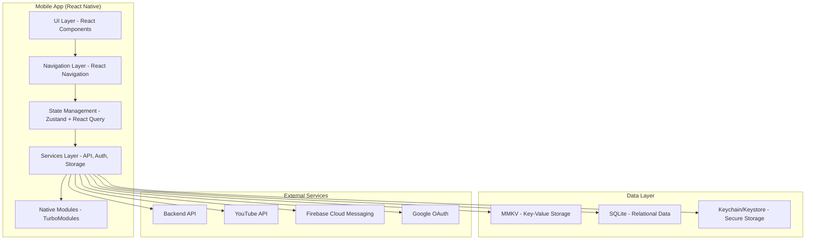
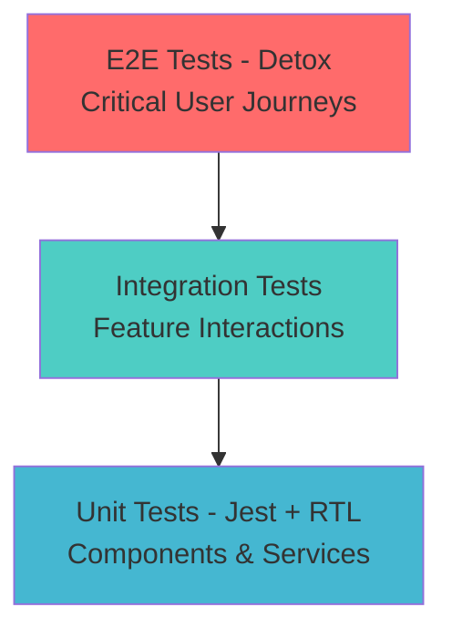

# Design Document

## Overview

The Teacher Hub mobile application will be rebuilt using React Native New Architecture (Fabric and TurboModules) with Hermes engine, providing a high-performance, offline-capable educational platform for Ugandan teachers. The app follows a feature-based modular architecture with TypeScript strict mode, emphasizing performance, security, accessibility, and user experience. The design prioritizes mobile-first interactions, offline functionality, and seamless integration with the existing backend infrastructure.

## Architecture

### High-Level Architecture



### Technology Stack

- **Runtime**: React Native 0.76+ with New Architecture (Fabric + TurboModules)
- **JavaScript Engine**: Hermes with precompilation
- **Language**: TypeScript 5.8+ in strict mode
- **Navigation**: React Navigation 7 with native stack
- **State Management**: Zustand for global state, React Query for server state
- **Animations**: React Native Reanimated 3.16+ and Gesture Handler
- **Storage**: MMKV for key-value, SQLite for relational data, Keychain/Keystore for secrets
- **Networking**: Axios with React Query for caching and retry logic
- **Real-time**: Socket.IO client for live messaging
- **Forms**: React Hook Form with Zod validation
- **Images**: FastImage with caching and WebP support
- **Lists**: FlashList for high-performance scrolling
- **Testing**: Jest, React Testing Library, Detox for E2E
- **Build**: EAS Build with GitHub Actions CI/CD
- **Monitoring**: Sentry for crash reporting and performance monitoring

### Project Structure

```
src/
├── components/           # Reusable UI components
│   ├── ui/              # Basic UI components (Button, Input, etc.)
│   ├── forms/           # Form-specific components
│   └── common/          # Shared components
├── features/            # Feature-based modules
│   ├── auth/            # Authentication feature
│   ├── posts/           # Posts management
│   ├── communities/     # Community features
│   ├── messaging/       # Real-time messaging
│   ├── resources/       # Resource sharing
│   └── profile/         # User profile management
├── navigation/          # Navigation configuration
├── services/            # External service integrations
│   ├── api/             # Backend API client
│   ├── storage/         # Local storage services
│   ├── auth/            # Authentication services
│   └── sync/            # Offline synchronization
├── store/               # Global state management
├── hooks/               # Custom React hooks
├── utils/               # Utility functions
├── types/               # TypeScript type definitions
└── constants/           # App constants and configuration
```

## Components and Interfaces

### Core Components

#### Authentication System
```typescript
interface AuthService {
  login(credentials: LoginCredentials): Promise<AuthResult>
  loginWithGoogle(): Promise<AuthResult>
  logout(): Promise<void>
  refreshToken(): Promise<string>
  verifyCredentials(documents: Document[]): Promise<VerificationResult>
  enableBiometrics(): Promise<boolean>
  authenticateWithBiometrics(): Promise<AuthResult>
}

interface AuthState {
  user: User | null
  isAuthenticated: boolean
  isLoading: boolean
  verificationStatus: VerificationStatus
  biometricsEnabled: boolean
}
```

#### Navigation System
```typescript
type RootStackParamList = {
  Auth: undefined
  Main: undefined
  Onboarding: undefined
}

type MainTabParamList = {
  Posts: undefined
  Communities: undefined
  Messages: undefined
  Resources: undefined
  Profile: undefined
}

interface NavigationService {
  navigate<T extends keyof RootStackParamList>(
    screen: T,
    params?: RootStackParamList[T]
  ): void
  goBack(): void
  reset(routeName: string): void
}
```

#### Data Management
```typescript
interface StorageService {
  // Key-value storage (MMKV)
  setItem(key: string, value: any): Promise<void>
  getItem<T>(key: string): Promise<T | null>
  removeItem(key: string): Promise<void>
  
  // Secure storage (Keychain/Keystore)
  setSecureItem(key: string, value: string): Promise<void>
  getSecureItem(key: string): Promise<string | null>
  removeSecureItem(key: string): Promise<void>
}

interface DatabaseService {
  // SQLite operations
  query<T>(sql: string, params?: any[]): Promise<T[]>
  execute(sql: string, params?: any[]): Promise<void>
  transaction(operations: () => Promise<void>): Promise<void>
}
```

#### Offline Synchronization
```typescript
interface SyncService {
  queueOperation(operation: OfflineOperation): Promise<void>
  syncPendingOperations(): Promise<SyncResult>
  downloadForOffline(resourceIds: string[]): Promise<void>
  getOfflineStatus(): OfflineStatus
  enableAutoSync(enabled: boolean): void
}

interface OfflineOperation {
  id: string
  type: 'CREATE' | 'UPDATE' | 'DELETE'
  resource: string
  data: any
  timestamp: number
  retryCount: number
}
```

### Feature Components

#### Posts Feature
```typescript
interface PostsService {
  getPosts(filters: PostFilters): Promise<PaginatedResponse<Post>>
  createPost(post: CreatePostRequest): Promise<Post>
  updatePost(id: string, updates: UpdatePostRequest): Promise<Post>
  deletePost(id: string): Promise<void>
  likePost(id: string): Promise<void>
  sharePost(id: string, shareData: ShareData): Promise<void>
}

interface Post {
  id: string
  title: string
  content: string
  author: User
  category: PostCategory
  mediaAttachments: MediaAttachment[]
  likes: number
  comments: number
  createdAt: Date
  updatedAt: Date
  isLiked: boolean
}
```

#### Communities Feature
```typescript
interface CommunityService {
  getCommunities(filters: CommunityFilters): Promise<Community[]>
  joinCommunity(id: string): Promise<void>
  leaveCommunity(id: string): Promise<void>
  getCommunityPosts(id: string): Promise<Post[]>
  getCommunityMembers(id: string): Promise<User[]>
}

interface Community {
  id: string
  name: string
  description: string
  category: CommunityCategory
  memberCount: number
  isPublic: boolean
  isJoined: boolean
  moderators: User[]
  createdAt: Date
}
```

#### Messaging Feature
```typescript
interface MessagingService {
  getConversations(): Promise<Conversation[]>
  getMessages(conversationId: string): Promise<Message[]>
  sendMessage(conversationId: string, content: string): Promise<Message>
  markAsRead(conversationId: string): Promise<void>
  searchUsers(query: string): Promise<User[]>
  createConversation(userIds: string[]): Promise<Conversation>
}

interface Message {
  id: string
  conversationId: string
  senderId: string
  content: string
  type: MessageType
  timestamp: Date
  isRead: boolean
  deliveryStatus: DeliveryStatus
}
```

#### Resources Feature
```typescript
interface ResourceService {
  getResources(filters: ResourceFilters): Promise<PaginatedResponse<Resource>>
  uploadResource(file: File, metadata: ResourceMetadata): Promise<Resource>
  downloadResource(id: string): Promise<Blob>
  rateResource(id: string, rating: number): Promise<void>
  deleteResource(id: string): Promise<void>
}

interface Resource {
  id: string
  title: string
  description: string
  type: ResourceType
  fileUrl: string
  thumbnailUrl?: string
  youtubeId?: string
  size: number
  category: ResourceCategory
  uploadedBy: User
  rating: number
  downloadCount: number
  isDownloaded: boolean
  createdAt: Date
}
```

## Data Models

### User and Authentication
```typescript
interface User {
  id: string
  email: string
  firstName: string
  lastName: string
  profilePicture?: string
  subjects: Subject[]
  gradeLevels: GradeLevel[]
  schoolLocation: Location
  yearsOfExperience: number
  verificationStatus: VerificationStatus
  createdAt: Date
  lastActiveAt: Date
}

interface AuthCredentials {
  email: string
  password: string
}

interface GoogleAuthResult {
  idToken: string
  accessToken: string
  user: GoogleUser
}

enum VerificationStatus {
  PENDING = 'pending',
  VERIFIED = 'verified',
  REJECTED = 'rejected'
}
```

### Content Models
```typescript
interface PostCategory {
  id: string
  name: string
  color: string
  icon: string
}

interface MediaAttachment {
  id: string
  type: 'image' | 'video' | 'document'
  url: string
  thumbnailUrl?: string
  filename: string
  size: number
}

interface ResourceCategory {
  id: string
  name: string
  subjects: Subject[]
  gradeLevels: GradeLevel[]
}

interface Subject {
  id: string
  name: string
  code: string
}

interface GradeLevel {
  id: string
  name: string
  order: number
}
```

### Offline and Sync Models
```typescript
interface OfflineStatus {
  isOnline: boolean
  pendingOperations: number
  lastSyncTime: Date
  syncInProgress: boolean
  storageUsed: number
  storageLimit: number
}

interface SyncResult {
  success: boolean
  operationsProcessed: number
  errors: SyncError[]
  nextSyncTime: Date
}

interface CachedResource {
  id: string
  resourceId: string
  localPath: string
  downloadedAt: Date
  size: number
  priority: CachePriority
}
```

## Error Handling

### Error Types and Handling Strategy

```typescript
enum ErrorType {
  NETWORK_ERROR = 'network_error',
  AUTHENTICATION_ERROR = 'auth_error',
  VALIDATION_ERROR = 'validation_error',
  STORAGE_ERROR = 'storage_error',
  PERMISSION_ERROR = 'permission_error',
  SYNC_ERROR = 'sync_error'
}

interface AppError {
  type: ErrorType
  message: string
  code: string
  details?: any
  timestamp: Date
  userId?: string
}

class ErrorHandler {
  static handle(error: AppError): void {
    // Log to monitoring service
    Sentry.captureException(error)
    
    // Show user-friendly message
    this.showUserMessage(error)
    
    // Attempt recovery if possible
    this.attemptRecovery(error)
  }
  
  static showUserMessage(error: AppError): void {
    const userMessage = this.getUserFriendlyMessage(error)
    ToastService.show(userMessage, 'error')
  }
  
  static attemptRecovery(error: AppError): void {
    switch (error.type) {
      case ErrorType.NETWORK_ERROR:
        NetworkService.retry()
        break
      case ErrorType.AUTHENTICATION_ERROR:
        AuthService.refreshToken()
        break
      case ErrorType.SYNC_ERROR:
        SyncService.retryFailedOperations()
        break
    }
  }
}
```

### Network Error Handling
```typescript
interface RetryConfig {
  maxRetries: number
  backoffMultiplier: number
  initialDelay: number
  maxDelay: number
}

class NetworkService {
  private static retryConfig: RetryConfig = {
    maxRetries: 3,
    backoffMultiplier: 2,
    initialDelay: 1000,
    maxDelay: 10000
  }
  
  static async request<T>(config: RequestConfig): Promise<T> {
    let lastError: Error
    
    for (let attempt = 0; attempt <= this.retryConfig.maxRetries; attempt++) {
      try {
        return await this.makeRequest<T>(config)
      } catch (error) {
        lastError = error
        
        if (!this.shouldRetry(error, attempt)) {
          break
        }
        
        await this.delay(this.calculateDelay(attempt))
      }
    }
    
    throw lastError
  }
}
```

## Testing Strategy

### Testing Pyramid



### Test Categories

#### Unit Tests (70% coverage target)
```typescript
// Component testing
describe('PostCard', () => {
  it('should render post content correctly', () => {
    const post = createMockPost()
    render(<PostCard post={post} />)
    
    expect(screen.getByText(post.title)).toBeVisible()
    expect(screen.getByText(post.content)).toBeVisible()
  })
  
  it('should handle like action', async () => {
    const onLike = jest.fn()
    const post = createMockPost()
    
    render(<PostCard post={post} onLike={onLike} />)
    
    await user.press(screen.getByRole('button', { name: /like/i }))
    
    expect(onLike).toHaveBeenCalledWith(post.id)
  })
})

// Service testing
describe('AuthService', () => {
  it('should login successfully with valid credentials', async () => {
    const credentials = { email: 'test@example.com', password: 'password' }
    const mockResponse = { token: 'jwt-token', user: mockUser }
    
    mockApiClient.post.mockResolvedValue({ data: mockResponse })
    
    const result = await AuthService.login(credentials)
    
    expect(result.success).toBe(true)
    expect(result.user).toEqual(mockUser)
  })
})
```

#### Integration Tests (20% coverage target)
```typescript
describe('Posts Feature Integration', () => {
  it('should create and display new post', async () => {
    // Setup authenticated user
    await AuthService.login(testCredentials)
    
    // Navigate to posts screen
    render(<App />)
    await user.press(screen.getByText('Posts'))
    
    // Create new post
    await user.press(screen.getByText('Create Post'))
    await user.type(screen.getByPlaceholderText('Title'), 'Test Post')
    await user.type(screen.getByPlaceholderText('Content'), 'Test content')
    await user.press(screen.getByText('Publish'))
    
    // Verify post appears in feed
    await waitFor(() => {
      expect(screen.getByText('Test Post')).toBeVisible()
    })
  })
})
```

#### E2E Tests (10% coverage target)
```typescript
describe('Authentication Flow', () => {
  beforeAll(async () => {
    await device.launchApp()
  })
  
  it('should complete full registration flow', async () => {
    // Start registration
    await element(by.text('Get Started')).tap()
    await element(by.text('Register')).tap()
    
    // Fill registration form
    await element(by.id('email-input')).typeText('teacher@example.com')
    await element(by.id('password-input')).typeText('SecurePass123!')
    await element(by.id('first-name-input')).typeText('John')
    await element(by.id('last-name-input')).typeText('Doe')
    
    // Submit registration
    await element(by.text('Register')).tap()
    
    // Verify navigation to verification screen
    await expect(element(by.text('Verify Your Credentials'))).toBeVisible()
  })
})
```

### Performance Testing
```typescript
describe('Performance Tests', () => {
  it('should render large post list efficiently', async () => {
    const largePosts = Array.from({ length: 1000 }, createMockPost)
    
    const startTime = performance.now()
    render(<PostsList posts={largePosts} />)
    const renderTime = performance.now() - startTime
    
    expect(renderTime).toBeLessThan(100) // 100ms threshold
  })
  
  it('should handle rapid navigation without memory leaks', async () => {
    const initialMemory = await getMemoryUsage()
    
    // Perform rapid navigation
    for (let i = 0; i < 50; i++) {
      await navigateToScreen('Posts')
      await navigateToScreen('Communities')
      await navigateToScreen('Messages')
    }
    
    const finalMemory = await getMemoryUsage()
    const memoryIncrease = finalMemory - initialMemory
    
    expect(memoryIncrease).toBeLessThan(50 * 1024 * 1024) // 50MB threshold
  })
})
```

## Security Architecture

### Authentication and Authorization
```typescript
interface SecurityService {
  // Token management
  storeTokenSecurely(token: string): Promise<void>
  getStoredToken(): Promise<string | null>
  refreshTokenIfNeeded(): Promise<string>
  
  // Device security
  checkDeviceIntegrity(): Promise<DeviceSecurityStatus>
  enableAppLock(): Promise<void>
  verifyBiometrics(): Promise<boolean>
  
  // Network security
  validateCertificate(certificate: Certificate): boolean
  encryptSensitiveData(data: any): string
  decryptSensitiveData(encryptedData: string): any
}

interface DeviceSecurityStatus {
  isJailbroken: boolean
  isRooted: boolean
  hasScreenLock: boolean
  biometricsAvailable: boolean
  isEmulator: boolean
}
```

### Data Protection
```typescript
class DataProtectionService {
  // Encrypt sensitive data before storage
  static encryptForStorage(data: any): string {
    const key = this.getEncryptionKey()
    return CryptoJS.AES.encrypt(JSON.stringify(data), key).toString()
  }
  
  // Decrypt data after retrieval
  static decryptFromStorage(encryptedData: string): any {
    const key = this.getEncryptionKey()
    const bytes = CryptoJS.AES.decrypt(encryptedData, key)
    return JSON.parse(bytes.toString(CryptoJS.enc.Utf8))
  }
  
  // Generate device-specific encryption key
  private static getEncryptionKey(): string {
    return DeviceInfo.getUniqueId() + Config.ENCRYPTION_SALT
  }
}
```

### Network Security
```typescript
// SSL Pinning configuration
const sslPinningConfig = {
  'api.teacherhub.ug': {
    certificateFilename: 'teacherhub-cert.cer',
    includeSubdomains: true
  }
}

// Request interceptor for security headers
axios.interceptors.request.use((config) => {
  config.headers['X-API-Version'] = '1.0'
  config.headers['X-Client-Type'] = 'mobile'
  config.headers['X-Device-ID'] = DeviceInfo.getUniqueId()
  
  return config
})
```

This comprehensive design document provides the foundation for rebuilding the mobile app with modern React Native architecture, focusing on performance, security, offline functionality, and excellent user experience. The modular structure and well-defined interfaces will enable efficient development and maintenance while ensuring scalability and reliability.