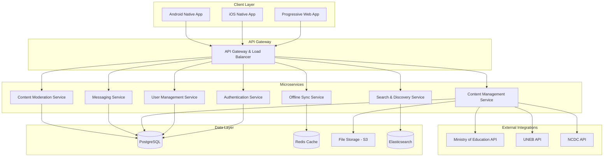
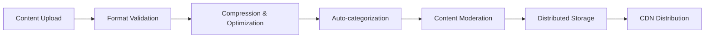
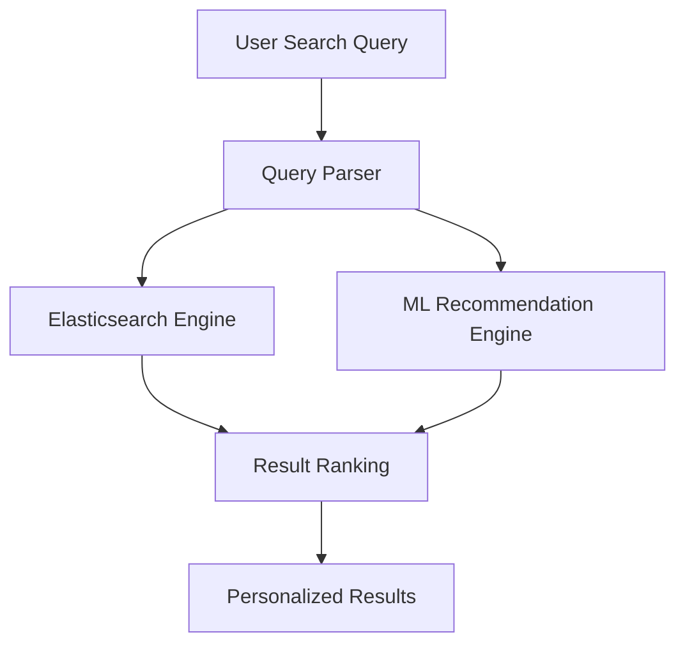
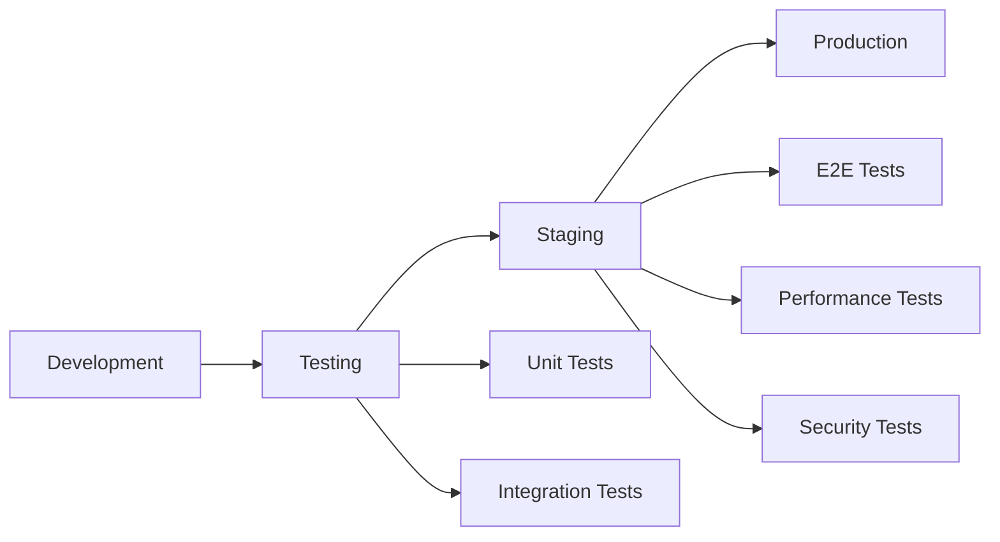

# Design Document

## Overview

Teacher Hub is designed as a progressive web application (PWA) with native mobile apps, optimized for Uganda's mobile-first environment and varying connectivity conditions. The platform employs a microservices architecture with offline-first capabilities, ensuring teachers can access critical functionality regardless of network availability. The system integrates with government institutions through secure APIs while maintaining a user-friendly interface that works across devices and connection speeds.

## Architecture

### High-Level Architecture



### Technology Stack

**Frontend:**
- React with TypeScript for web application
- React Native for mobile apps
- PWA capabilities with service workers
- Tailwind CSS for responsive design
- Redux Toolkit for state management

**Backend:**
- Node.js with Express.js for API services
- PostgreSQL for primary data storage
- Redis for caching and session management
- Elasticsearch for search functionality
- AWS S3 for file storage

**Infrastructure:**
- Docker containers for microservices
- AWS ECS for container orchestration
- CloudFront CDN for content delivery
- AWS Lambda for serverless functions

## Components and Interfaces

### Authentication Service

**Purpose:** Manages user authentication, authorization, and credential verification

**Key Components:**
- JWT token management with refresh token rotation
- Multi-factor authentication for sensitive operations
- Integration with Uganda's teacher verification systems
- OAuth2 implementation for third-party integrations

**API Endpoints:**
```
POST /auth/register - Teacher registration with credential verification
POST /auth/login - User authentication
POST /auth/refresh - Token refresh
POST /auth/verify-credentials - Teaching credential verification
GET /auth/profile - User profile retrieval
```

### User Management Service

**Purpose:** Handles user profiles, preferences, and relationship management

**Key Components:**
- Teacher profile management with verification status
- Connection and following system
- Privacy settings and content preferences
- Activity tracking and analytics

**Data Models:**
```typescript
interface TeacherProfile {
  id: string;
  email: string;
  fullName: string;
  subjects: string[];
  gradeLevels: string[];
  schoolLocation: Location;
  yearsExperience: number;
  verificationStatus: 'pending' | 'verified' | 'rejected';
  credentials: Credential[];
  preferences: UserPreferences;
}
```

### Content Management Service

**Purpose:** Manages educational resources, government content, and user-generated materials

**Key Components:**
- Multi-format content handling (video, images, documents, text)
- Content categorization and tagging system
- Version control for collaborative documents
- Integration with government content APIs
- Content compression and optimization

**Content Pipeline:**


### Messaging Service

**Purpose:** Facilitates real-time communication between teachers

**Key Components:**
- WebSocket connections for real-time messaging
- Message queuing for offline users
- Group chat functionality
- File sharing within conversations
- Message encryption for privacy

### Search & Discovery Service

**Purpose:** Provides intelligent search and content recommendation

**Key Components:**
- Elasticsearch-powered full-text search
- Machine learning-based recommendations
- Curriculum alignment matching
- Trending content identification
- Personalized content suggestions

**Search Architecture:**


### Offline Sync Service

**Purpose:** Manages offline functionality and data synchronization

**Key Components:**
- Conflict resolution algorithms
- Priority-based sync queues
- Incremental data updates
- Storage quota management
- Background sync scheduling

## Data Models

### Core Entities

```typescript
interface Resource {
  id: string;
  title: string;
  description: string;
  type: 'video' | 'image' | 'document' | 'text';
  format: string;
  size: number;
  url: string;
  thumbnailUrl?: string;
  subjects: string[];
  gradeLevels: string[];
  curriculumAlignment: string[];
  author: TeacherProfile;
  isGovernmentContent: boolean;
  verificationStatus: 'verified' | 'pending' | 'flagged';
  downloadCount: number;
  rating: number;
  tags: string[];
  createdAt: Date;
  updatedAt: Date;
}

interface Message {
  id: string;
  senderId: string;
  recipientId?: string;
  groupId?: string;
  content: string;
  type: 'text' | 'file' | 'image';
  attachments: Attachment[];
  timestamp: Date;
  readBy: string[];
  syncStatus: 'synced' | 'pending' | 'failed';
}

interface Community {
  id: string;
  name: string;
  description: string;
  type: 'subject' | 'region' | 'grade' | 'general';
  members: string[];
  moderators: string[];
  isPrivate: boolean;
  rules: string[];
  createdAt: Date;
}
```

### Government Integration Models

```typescript
interface GovernmentContent {
  id: string;
  source: 'MOE' | 'UNEB' | 'NCDC';
  contentType: 'curriculum' | 'policy' | 'resource' | 'announcement';
  title: string;
  content: string;
  attachments: Attachment[];
  targetAudience: string[];
  priority: 'high' | 'medium' | 'low';
  effectiveDate: Date;
  expiryDate?: Date;
  digitalSignature: string;
  verificationHash: string;
}
```

## Error Handling

### Error Categories and Responses

**Network Errors:**
- Implement exponential backoff for API retries
- Queue operations for offline execution
- Provide clear offline indicators to users
- Cache critical data for offline access

**Authentication Errors:**
- Automatic token refresh with fallback to re-authentication
- Secure credential storage with biometric options
- Clear error messages for credential verification failures

**Content Errors:**
- Graceful degradation for unsupported file formats
- Alternative content suggestions for unavailable resources
- Comprehensive logging for content moderation issues

**Sync Conflicts:**
- Last-writer-wins for simple conflicts
- User-mediated resolution for complex conflicts
- Automatic backup creation before conflict resolution

### Error Response Format

```typescript
interface ErrorResponse {
  error: {
    code: string;
    message: string;
    details?: any;
    timestamp: Date;
    requestId: string;
  };
  suggestions?: string[];
  retryAfter?: number;
}
```

## Testing Strategy

### Unit Testing
- Jest for JavaScript/TypeScript unit tests
- 90% code coverage requirement
- Mock external dependencies and APIs
- Test offline functionality scenarios

### Integration Testing
- API endpoint testing with Supertest
- Database integration tests with test containers
- Government API integration testing with mock services
- Real-time messaging functionality testing

### End-to-End Testing
- Cypress for web application E2E tests
- Detox for React Native E2E tests
- Cross-browser compatibility testing
- Mobile device testing on various screen sizes

### Performance Testing
- Load testing with Artillery.js
- Mobile performance testing with Lighthouse
- Offline sync performance validation
- Content delivery optimization testing

### Security Testing
- OWASP security scanning
- Penetration testing for authentication flows
- Data encryption validation
- Government API security compliance testing

### Accessibility Testing
- WCAG 2.1 compliance validation
- Screen reader compatibility testing
- Keyboard navigation testing
- Color contrast and visual accessibility checks

### Testing Environments



## Mobile Optimization Considerations

### Progressive Web App Features
- Service worker for offline functionality
- App shell architecture for fast loading
- Push notifications for important updates
- Add to home screen capability

### Performance Optimizations
- Image lazy loading and compression
- Code splitting for faster initial loads
- Critical CSS inlining
- Resource prefetching for anticipated user actions

### Offline-First Architecture
- Local SQLite database for critical data
- Background sync with conflict resolution
- Intelligent caching strategies
- Progressive data loading

### Accessibility Features
- Voice-over support for visually impaired users
- High contrast mode for better visibility
- Adjustable font sizes
- Simplified navigation for users with motor impairments